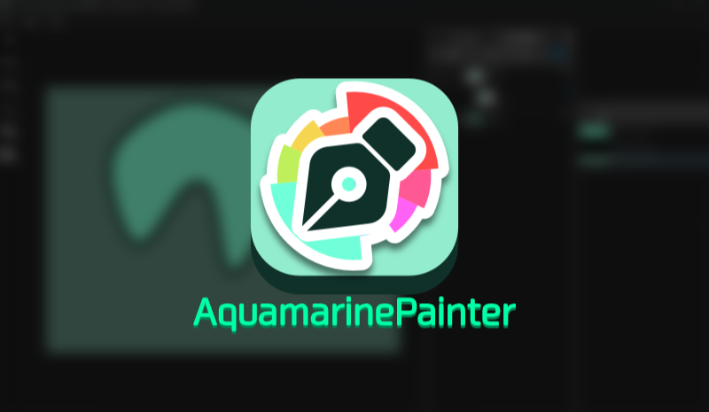
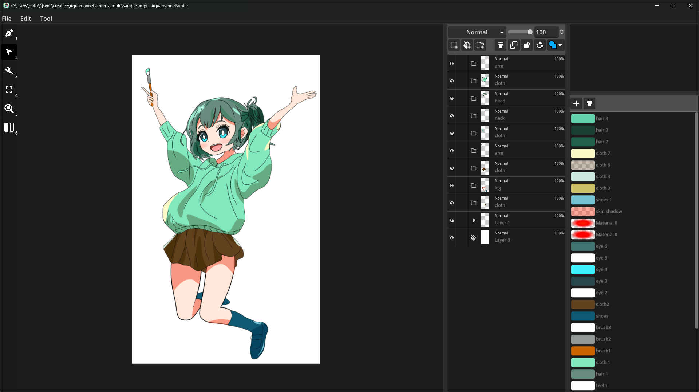
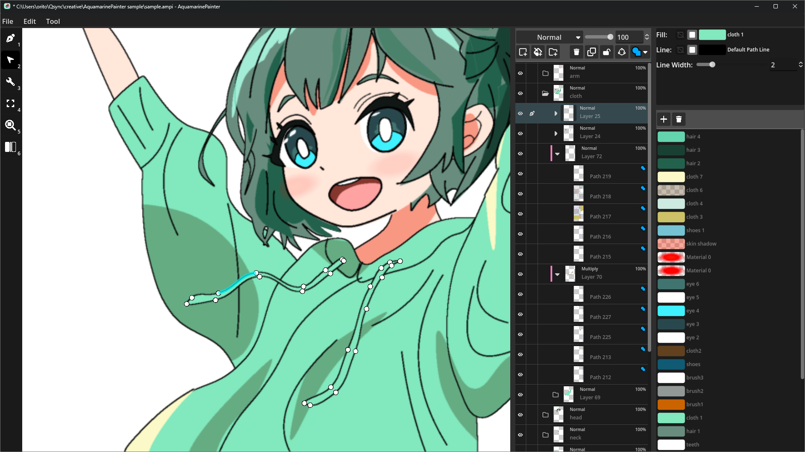
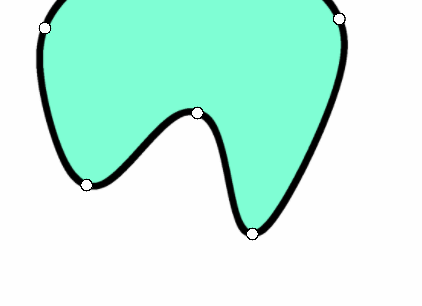

<h1 align="center">Aquamarine Painter</h1>

[<a href="./README.md">ja</a> | <a href="./README/README-en.md">en</a>]

## スクリーンショット

https://github.com/user-attachments/assets/64b61a46-360f-4107-a62b-e9491fa3b449

## PPW Curves

このソフトウェアでは[PPW Curves](https://www.jstage.jst.go.jp/article/transinf/E105.D/10/E105.D_2022PCP0006/_pdf)というスプライン曲線を利用しています。

この曲線はすべてのコントロールポイントを通る曲線で、調整ツールを利用することで以下のようなパラメータの調整ができます。

| 操作 | gif |
| --- | --- |
| コントロールポイントを左右ドラッグ |  |
| コントロールポイントの間のセグメントを上下にドラッグ |  |
| コントロールポイントの間のセグメントを左右にドラッグ |  |

## キーボードショートカット

| キー | 機能 |
| --- | --- |
| `Ctrl` + `Z` | アンドゥ |
| `Ctrl` + `Shift` + `Z` | リドゥ |
| `Ctrl` + `C` | 選択中のマテリアル or レイヤーのコピー |
| `Ctrl` + `V` | ペースト |
| `1` | 描画ツール |
| `2` | 操作ツール |
| `3` | 調整ツール |
| `4` | 枠内に収める |
| `5` | 拡大率を100%に戻す |
| `6` | 左右反転 |
| `Space` | コントローラーの一時非表示 |

## 免責事項

このアプリは個人用に作成したものであり、OSSプロジェクトとして機能追加・要望対応などを行っていく予定はありません。
このアプリのソースコードはMITライセンスで配布しているので、必要があればforkして自分で機能を追加してください。

## LICENSE

このアプリのソースコードはMITライセンスで配布しています。

一部にMPL-2.0ライセンスのプログラムを利用しています。
