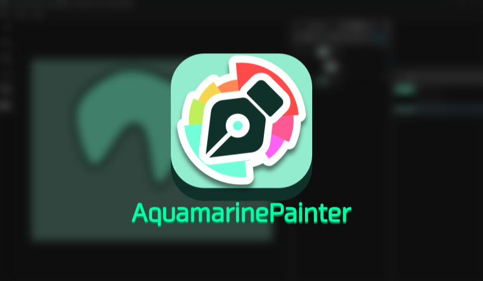
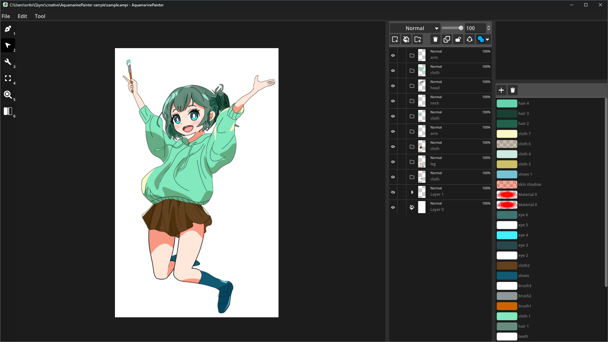
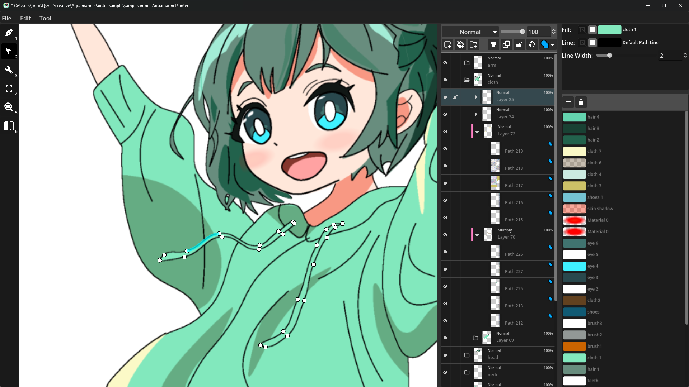
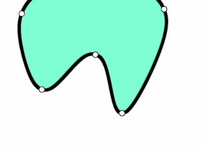

<h1 align="center">Aquamarine Painter</h1>

[<a href="../README.md">ja</a> | <a href="./README-en.md">en</a>]

## Screenshots

https://github.com/user-attachments/assets/64b61a46-360f-4107-a62b-e9491fa3b449

## PPW Curves

This software uses a spline curve called [PPW Curves](https://www.jstage.jst.go.jp/article/transinf/E105.D/10/E105.D_2022PCP0006/_pdf).

This curve passes through all the control points, and you can adjust the following parameters using the adjustment tool.

| Operation | gif |
| --- | --- |
| Drag the control points left and right. |  |
| Drag the segment between the control points up and down. |  |
| Drag the segment between the control points left and right. |  |

## Keyboard Shortcuts

| Key | Function |
| --- | --- |
| `Ctrl` + `Z` | Undo |
| `Ctrl` + `Shift` + `Z` | Redo |
| `Ctrl` + `C` | Copy selected material or layer |
| `Ctrl` + `V` | Paste |
| `1` | Painting Tools |
| `2` | Operation Tools |
| `3` | Adjustment Tools |
| `4` | Fit in Frame |
| `5` | Reset Zoom to 100% |
| `6` | Flip Horizontal |
| `Space` | Temporary hiding of controllers |

## Disclaimer

This app was created for personal use, and there are no plans to add features or respond to requests as an OSS project.
The source code for this app is distributed under the MIT license, so if you need to, please fork it and add your own functions.

## LICENSE

The source code for this application is distributed under the MIT license.

This program uses MPL-2.0 licensed programs.
